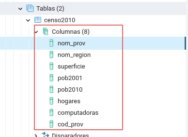

# Clase 1

## Temas de esta clase: 

-   Introducción a las bases de datos.
-   Bases de datos relacionales.
-   Motores de bases de datos: PostgreSQL
-   Elementos de una base de datos: Esquemas, tablas, campos, registros.
-   SQL: comandos de selección.
-   Visualización de información geográfica de la base desde Qgis.

### Referencias:

    A lo largo del documento encontraremos recuadros que requieren de una especial atención de los lectores:

> **ACTIVIDADES:** son consignas de actividades para realizar la práctica con Qgis, PGAdmin y las otras herramientas acompañando la lectura. En la presente clase hay 5 actividades para resolver. 

> **¡IMPORTANTE!:** Indica una actividad que no debe omitirse para poder desarrollar correctamente la práctica de la clase.

## 1 Bases de datos
### 1.1 Base de datos. Definición. 

Una base de datos es un conjunto de datos almacenados con una estructura lógica; es decir, tan importante como los datos, es la estructura conceptual con la que se relacionan los datos entre sí mismos. En la práctica, se puede pensar esto como el conjunto de datos más los programas (software) que hacen de ellos un conjunto existente. 

Al igual que con el concepto de SIG, es interesante conocer otras definiciones que existen para “Base de datos”: 
- "Colección de datos interrelacionados almacenados en conjunto sin redundancias perjudiciales o innecesarias; su finalidad es servir a una o más aplicaciones de la mejor forma posible; los datos se almacenan de modo que resulten independientes de los programas que los usan. Se emplean métodos bien determinados para incluir nuevos datos y para modificar o extraer los datos almacenados" (Martin, 1975). 
- "Colección integrada y generalizada de datos, estructurada atendiendo a las relaciones naturales, de modo que suministre todos los caminos de acceso necesarios a cada unidad de datos con objeto de poder atender todas las necesidades de los diferentes usuarios" (Deen, 1985).  
- "Colección de datos integrados, con redundancia controlada y con una estructura que refleje las interrelaciones y restricciones existentes en el mundo real; los datos, que han de ser compartidos por diferentes usuarios y aplicaciones, deben mantenerse independientes de éstas, y su definición y descripción, únicas para cada tipo de datos, han de estar almacenadas junto con los mismos. Los procedimientos de actualización y recuperación, comunes y bien determinados, habrán de ser capaces de conservar la integridad, seguridad y confidencialidad del conjunto de los datos" (A. de Miguel, 1993).  
- "Una base de datos consiste en alguna colección de datos persistentes e independientes usados por una organización determinada" (Date, 1995). 
Las definiciones de base de datos son numerosas. Todas coinciden en que son un conjunto de datos almacenados en un soporte de acceso directo. Los datos están interrelacionados y estructurados de acuerdo a un modelo que sea capaz de recoger el máximo contenido semántico. 

### 1.2 Características de las bases de datos 

El concepto de Base de Datos determina algunas características que le son propias, por ejemplo: 
-   El mundo real considera interrelaciones entre datos y restricciones semánticas que deben estar presentes en una base de datos. Una base de datos no solo debe almacenar entidades y atributos (recordar los sistemas tradicionales de archivos), sino que también debe almacenar interrelaciones entre datos. Por otro lado, actualmente se le está dando mucha importancia a las restricciones semánticas, de manera que éstas se almacenan junto con los datos. 
-   La redundancia de datos debe ser controlada, de forma que no existan duplicidades perjudiciales e innecesarias. Las redundancias físicas, convenientes muchas veces a fin de responder a objetivos de eficiencia, son tratadas por el mismo sistema, de modo que no puedan producirse incoherencias. Esto significa que en las bases de datos no está permitida la redundancia lógica, pero si se admite cierta redundancia física por motivos de eficiencia. 
-   Las bases de datos pretenden servir a toda la organización; es decir, a múltiples usuarios y a diferentes aplicaciones.
-   La definición y descripción del conjunto de datos contenido en la base debe ser única e integrada con los mismos datos. En las bases de datos, la descripción, y en algunos casos también, una definición y documentación completas se almacenan junto con los datos, de modo que éstos estén documentados, y cualquier cambio que se produzca en la documentación debe quedar recogido en el sistema. 
-   La actualización y recuperación de las bases de datos debe realizarse mediante procesos bien determinados, procedimientos que han de estar diseñados de modo que se mantenga la integridad, seguridad y confidencialidad de la base. 
El objetivo de disminuir la redundancia de un conjunto de datos determina dos características fundamentales que poseerá cualquier sistema de Bases de Datos:

        a) Integrada: una base de datos puede considerarse como una unificación de varios archivos de datos independientes, donde se elimina parcial o totalmente cualquier redundancia entre los mismos. 
        
        b) Compartida: Se entiende que partes individuales de la Base de Datos pueden compartirse entre varios usuarios distintos, en el sentido que cada uno de ellos puede tener acceso a la misma parte de la Base de Datos y utilizarla con propósitos diferentes. Tal comportamiento es, en verdad, consecuencia del hecho de que la Base de Datos es integrada. 

Consecuencia del hecho de que la Base de Datos sea integrada, se advierte que cualquier usuario tendrá acceso para modificar sólo algún subconjunto de la base completa; además, los subconjuntos de diferentes usuarios se procesarán de muy diversas maneras. En otras palabras, diferentes usuarios percibirán de modos muy distintos una base de datos. 

### 1.3 Ventajas de la utilización de bases de datos

Veremos a continuación las principales ventajas de las bases de datos con respecto a gestión no organizada de los datos. Entiéndase gestión no organizada de los datos a la forma de trabajo que generalmente se  utiliza, en donde los datos se almacenan en archivos sueltos, generados para ser utilizado en cada proyecto y que no pueden ser modificados por más de un usuario a la vez : 
-   Independencia de los datos respecto a los tratamientos y viceversa: esto supone que un cambio en los tratamientos no imponga un nuevo diseño lógico y/o físico de la base de datos. Por otro lado, cambios en la incorporación, desaparición de datos, cambios en la estructura física o caminos de acceso no deben obligar a alterar los programas. Así se evita la reprogramación de las aplicaciones. Es el punto de partida para la adaptación de los sistemas de información a la evolución de las organizaciones. 
-   Coherencia de los resultados: debido a que la información de la Base de Datos se recoge y se almacena una sola vez, en todos los tratamientos se utilizan los mismos datos, por lo que los resultados de estos son coherentes y comparables. Así, se eliminan las divergencias en los resultados. 
-   Mejor disponibilidad de los datos para el conjunto de los usuarios: en una Base de Datos ningún usuario es propietario de los datos, pues éstos se comparten entre las aplicaciones, existiendo una mayor disponibilidad y transparencia. 
-   Mayor valor informativo: esto se refiere al concepto de sinergia, en donde el valor informativo del conjunto de datos es superior a la suma del valor informativo de los elementos individuales. 
-   Mejor y más normalizada documentación: la mayoría de los SGBD proporcionan herramientas para reflejar el contenido semántico de los datos; es decir, incluyen una descripción de los datos dentro del sistema. 
-   Mayor eficiencia en la captura, validación e ingreso de datos al sistema: al no existir redundancias, los datos se capturan y validan una sola vez aumentando el rendimiento del proceso previo al almacenamiento. 
-   Reducción del espacio de almacenamiento: por un lado, la disminución de redundancias y las técnicas de compactación hacen que disminuya el espacio en disco. Sin embargo, los diccionarios, referencias, punteros, listas invertidas también ocupan espacio. 

### 1.4 Modelos de bases de datos

Una base de datos puede ser clasificada en función del modelo que se utiliza para construirla. Los modelos implican una forma particular de almacenar los datos, la forma en que se estructuran los datos y las relaciones que se establecen entre estos.
Cada modelo tiene sus ventajas e inconvenientes, y para cada uso es necesario decidir el modelo más conveniente.
De los distintos modelos existentes, los más habituales son: 
-   Bases de datos jerárquicas
-   Bases de datos en red
-   Bases de datos relacionales
-   Bases de datos orientadas a objetos
De todos estos modelos, las bases de datos relacionales son en este momento el modelo más utilizado en todo tipo de ámbitos, y especialmente en los SIG.

## 2 Bases de datos relacionales

Este es el modelo más utilizado en la actualidad para modelar problemas reales y administrar datos dinámicamente, y es el modelo de base de datos que utilizaremos en el curso. Tras ser postulados sus fundamentos en 1970 por Edgar Frank Codd, de los laboratorios IBM en San José (California), no tardó en consolidarse como un nuevo paradigma en los modelos de base de datos. Su idea fundamental es el uso de relaciones. Estas relaciones podrían considerarse en forma lógica como conjuntos de datos llamados tuplas. Pese a que ésta es la teoría de las bases de datos relacionales creadas por Edgar Frank Codd, la mayoría de las veces se conceptualiza de una manera más fácil de imaginar. Esto es pensando en cada relación como si fuese una tabla que está compuesta por registros (las filas de una tabla), que representarían a las tuplas, y los campos (las columnas de una tabla). 
En este modelo, el lugar y la forma en que se almacenen los datos no tienen relevancia (a diferencia de otros modelos como el jerárquico y el de red). Esto tiene la considerable ventaja de que es más fácil de entender y de utilizar para un usuario esporádico de la base de datos. La información puede ser recuperada o almacenada mediante "consultas" que ofrecen una amplia flexibilidad y poder para administrar la información. 

## 3 PostgreSQL

PostgreSQL es un motor de bases de datos, es servidor de bases de datos relacional libre, liberado bajo la licencia BSD. Es el motor de base de datos que utilizaremos en este curso. 

Principales características: 

-   *Alta concurrencia:* Mediante un sistema denominado MVCC (Acceso concurrente multiversión) PostgreSQL permite que, mientras un proceso escribe en una tabla, otros accedan a la misma tabla sin necesidad de bloqueos. Cada usuario obtiene una visión consistente de lo último a lo que se le hizo ‘commit’. Esta estrategia es superior al uso de bloqueos por tabla o por filas común en otras bases; eliminando la necesidad del uso de bloqueos explícitos. 

-   *Amplia variedad de tipos nativos:* PostgreSQL provee nativamente soporte para: 
    -   Números de precisión arbitraria 
    -   Texto de largo ilimitado 
    -   Figuras geométricas (con una variedad de funciones asociadas) 
    -   Direcciones IP (IPv4 e IPv6) 
    -   Bloques de direcciones estilo CIDR 
    -   Direcciones MAC 
    -   Arrays
    -   JSON
    -   JSONB 
    -   Adicionalmente los usuarios pueden crear sus propios tipos de datos, los que pueden ser por completo indexables gracias a la infraestructura GiST de PostgreSQL. Algunos ejemplos son los tipos de datos SIG creados por el proyecto PostGIS. 

-   *Otras características:* Claves ajenas también denominadas Llaves ajenas o Llaves Foráneas (foreign keys) 
    -   Disparadores (triggers) 
    -   Vistas
    -   Vistas Materializadas  
    -   Integridad transaccional 
    -   Herencia de tablas 
    -   Tipos de datos y operaciones geométricas 

-   *Funciones:* Bloques de código que se ejecutan en el servidor. Pueden ser escritos en varios lenguajes, con la potencia que cada uno de ellos da, desde las operaciones básicas de programación, tales como bifurcaciones y bucles, hasta las complejidades de la programación de orientación a objetos o la programación funcional. 
Los disparadores (triggers en inglés) son funciones enlazadas a operaciones sobre los datos. 

## 3.1 Breve historia de PostgreSQL

PostgreSQL es el último resultado de una larga evolución comenzada con el proyecto Ingres en la Universidad de Berkeley. El líder del proyecto, Michael Stonebraker abandonó Berkeley para comercializar Ingres en 1982, pero finalmente regresó a la academia. Tras su retorno a Berkeley en 1985, Stonebraker comenzó un proyecto post-Ingres para resolver los problemas con el modelo de base de datos relacional que había sido aclarado a comienzos de los años 1980. El principal de estos problemas era la incapacidad del modelo relacional de comprender "tipos"; es decir, combinaciones de datos simples que conforman una única unidad. Actualmente, estos son llamados objetos. 

El proyecto resultante, llamado Postgres, era orientado a introducir la menor cantidad posible de funcionalidades para completar el soporte de tipos. Estas funcionalidades incluían la habilidad de definir tipos, pero también la habilidad de describir relaciones - las cuales hasta ese momento eran ampliamente utilizadas pero mantenidas completamente por el usuario. En Postgres la base de datos involucraba las relaciones y podía obtener información de tablas relacionadas utilizando reglas. 

Habiendo comenzado en 1986, el equipo liberó una serie de documentos que describían la base del sistema y en 1988 ya poseían un prototipo funcional. La versión 1 fue liberada a un pequeño grupo de usuarios en junio de 1989, seguida por la versión 2 con un sistema de reglas reescrito en junio de 1990. Para la versión 3, liberada en 1991, el sistema de reglas fue reescrito nuevamente, pero también agregó soporte para múltiples administradores de almacenamiento y un sistema de consultas mejorado. Hacia 1993, Postgres había crecido inmensamente en popularidad y poseía una demanda asfixiante de nuevas funcionalidades. Tras liberar la versión 4, la cual era una simple versión de limpieza, el proyecto fue abandonado. 

A pesar de que el proyecto Postgres hubiese finalizado oficialmente, la licencia BSD bajo la cual Postgres había sido liberado permitió a desarrolladores de código abierto obtener una copia del código para continuar con su desarrollo. 

## 3.2 pgAdmin4 como Sistema gestor de base de datos (SGBD) 

Podemos abrir PGAdmin, el SGBD (sistema gestor de bases de datos) que trae consigo la instalación de Postgres desde Inicio, Programas, Postgres, PGAdmin.

> Si es la primera vez que abrimos pgAdmin4 vamos a tener que establecer una contraseña maestra que debemos recordar.

Al abrirse, PGAdmin muestra una ventana con dos secciones y una barra de herramientas en la parte superior.

Antes de continuar, vamos a configurar el idioma de esta aplicación, en caso de que los menús se muestren en inglés. 

Vamos a File, Preferences...
 allí en la solapa Miscellaneous, cambiamos la opción en User Language. Seleccionamos la opción Spanish.

Luego cerramos la ventana, cerramos pgAdmin4, y lo volvemos a iniciar.

Continuemos. En la barra lateral izquierda veremos una sección llamada *Servers* donde se listan todas nuestras conexiones. Para poder trabajar con el motor de postgres vamos a tener que establecer una conexión.

> Si instalamos pgAdmin4 por medio del instalador de PostgreSQL probablemete ya nos figure una conexión a *localhost*, podemos usar esa o crear una nueva.

Para agregar una conexión a un servidor hacemos clic derecho sobre *Servers* y elegimos crear servidor, también lo podemos hacer desde la sección de accesos directos. 

Aparecerá una ventana en donde ingresaremos los parámetros de conexión al motor de Postgres. Prestemos atención a estos datos, ya que serán necesarios en todo momento que debamos conectarnos a Postgres, tanto desde pgAdmin4, como desde cualquier otro cliente de bases de datos (Qgis).

En la pestaña **General** nos pide que le asignemos un nombre a la conexión, para diferenciarla de otras posibles conexiones. En este caso, sugerimos colocarle el nombre **curso**.

En la pestaña **Conexión** se visualiza una gran cantidad de opciones a definir. Vamos a concentrarnos en cuatro datos que nunca deben faltar para lograr una conexión al servidor:

Nombre del servidor: es el nombre o número IP de la máquina donde hemos instalado el motor de Postgres. Cuando se trabaja en la misma máquina en la que está instalado Postgres, el servidor se denomina “localhost”

Puerto: Por defecto se le asigna el puerto 5432 a Postgres. En caso de que no se conecte, es necesario preguntar al área de soporte informático.

Nombre de usuario: es el nombre del usuario que nos asignaron para acceder a Postgres. En este primer momento usaremos el usuario administrador llamado “postgres”
Contraseña: es la clave con la que accede el usuario mencionado arriba. En este primer momento la clave es “postgres”. Si no funciona, hay que consultar con quienes hicieron la instalación de Postgres.

> **¡IMPORTANTE!:** Si la conexión no se produce, en primer lugar hay que chequear que los parámetros colocados sean los correctos: nombre o IP del servidor, puerto, usuario y contraseña. 
También es necesario corroborar que estén correctamente otorgados los permisos en el servidor, en el caso de estar intentando un conexión a un servidor postgres remoto.

A partir de la creación de la nueva conexión, vemos que aparece un nuevo elemento en el panel de la izquierda. Este panel muestra el explorador de objetos, y veremos que se irá poblando de elemento a medida que avancemos con el curso. 

El panel de la derecha muestra diferentes secciones relacionadas al objeto que está seleccionado en el explorador de objetos de la izquierda. Por ejemplo, podemos hacer clic sobre la nueva conexión que hemos creado para ver sus propiedades desplegadas a la derecha.

Una vez creada la conexión, debemos activarla para empezar a trabajar con Postgres, pgAdmin nos muestra si la conexión es activa o no desplegando un icono correspondiente a su estado a la izquierna del nombre de la conexión.

Conexión activa             |  Conexión Inactiva
:--------------------------:|:-------------------------:
  |  

> Se puede activar una conexión haciendo doble clic sobre su nombre o desplegando el simbolo ">" a su izquierda.

> Para desactivar una conexión simplemente se hace clic derecho sobre la conexión y se selecciona la opción **Desconectar del servidor**

Si hacemos un clic sobre el símbolo “>” vemos como aparecen los nuevos objetos. De entre ellos, nos enfocaremos por ahora en las Bases de Datos.

En este momento podemos tener una o dos bases de datos (dependiendo si elegimos crear una base espacial durante la instalación de PostGIS).

Vamos a crear una nueva base de datos que se llamará “curso”. Hacemos clic con el botón derecho sobre  Bases de Datos

Se nos abrirá una ventana para determinar las propiedades de la nueva base.

Además del nombre de la nueva base, otro dato importante es el propietario. El propietario es el usuario de Postgres que por defecto tiene permisos especiales sobre la base por el hecho de pertenecerle. En este caso, el propietario es “postgres”. 

Luego de presionar **Guardar**, vemos que en el explorador de objetos de la izquierda, aparece un nuevo elemento: la base curso. 

Vemos que de nuestra nueva base se despliegan varios objetos. De ellos, vamos a prestarle atención a 2: **Esquemas** y **Extensiones**.

### a) Extensiones:
PostgreSQL está diseñado para ser fácilmente extensible. Por esta razón, las extensiones cargadas en la base de datos pueden funcionar como funciones integradas. 

Este curso está diseñado para el uso de una extensión muy especial que se llama **PostGIS** que nos permite poder trabajar con datos geométricos ademas de alfanuméricos.

Para agregar la extensión PostGIS a nuestra base *curso* simplemente hacemos clic derecho sobre el objeto *Extensiones* > Crear > Extensión.
Se desplegará una nueva ventana, donde en *Nombre* tendremos que seleccionar la opción **postgis** desde la lista desplegable.

Luego de guardar, podemos ver que se agregó un objeto nuevo a nuestro listado de extensiones

> **Nota:** También podemos crear la extensión usando la sentencia SQL: *CREATE EXTENSION postgis;*

### b) Esquemas:

Los esquemas son compartimentos de la base de datos que nos permiten organizar las tablas según el criterio que deseamos emplear. Por ejemplo, se pueden poner tablas con datos espaciales en un esquema, tablas con solo datos alfanuméricos en otro esquema, o se pueden organizar esquemas en función del origen de los datos (INDEC, INTA, Instituto Geográfico Nacional, relevamientos propios, etc.)

Por defecto, una base siempre debe tener, al menos, un esquema. Es por ello que la base nueva que acabamos de crear ya tiene incorporado el esquema **public**. Para ver el esquema **public** hacemos clic sobre el botón de ">" de Esquemas.

De la larga lista de elementos que aparecen allí, nuevamente nos concentraremos en uno: las tablas. Aquí es donde empezamos a tomar contacto con la información almacenada. 

Las tablas que aquí se presentan (clic en “>” de Tablas) son las que utiliza PostGIS para manejar los datos espaciales. En la clase siguiente veremos de qué se tratan los datos contenidos en estas tablas.

Ahora agregaremos una nueva tabla a la base de datos. Lo haremos a través de la restauración de un archivo de resguardo. Este tipo de archivos se crea desde pgAdmin y sirve para guardar una copia segura de los datos, o para transferir los datos a otro usuario. Utilizaremos el archivo llamado [censo2010.backup](material/censo2010.backup) que acompaña el material de práctica de esta clase.

Hacemos clic con el botón derecho sobre el ícono de la base “curso”, y de la
lista desplegable seleccionamos la opción Restaurar…

Cuando se abre la ventana, en Nombre del Archivo exploramos hasta encontrar
el archivo de resguardo censo2010.backup. Luego presionamos **Restaurar**.

Veremos una ventana que nos indica el estado del proceso y nos avisará cuando la restauración ha terminado.

Ahora podemos ver que se ha agregado un nuevo elemento dentro de Tablas.

En caso de no aparecer la nueva tabla recordemos que podemos seleccionar el ícono
de Tablas y luego hacer clic derecho y Actualizar

En el panel derecho podemos observar la pestaña llamada **SQL** donde podemos ver la sintaxis SQL que crea el objeto señalado en el panel de objetos.

Si analizamos un poco esta consulta, vemos que hay una orden de crear una tabla, y luego se enumeran los nombres de los campos o columnas con el tipo de dato que cada una de ellas almacenará.

Por ahora no nos detendremos demasiado en analizar esta consulta, pero sí es
importante saber que cada objeto de la base de datos se crea y modifica utilizando el
lenguaje de consulta SQL. A pesar de ello, veremos que también se pueden realizar
las mismas acciones oprimiendo botones, arrastrando objetos, haciendo clics, etc...

Para visualizar los datos de la tabla, primero la seleccionamos en el árbol de
objetos de la izquierda, y luego apretamos el botón *Ver los datos* del objeto ubicado en la barra de navegación de objetos.

Vemos que se trata de una tabla con ocho campos (columnas) y 24 registros (filas). Y también podemos comprobar lo que vimos anteriormente en el script SQL con respecto al tipo de datos de cada campo.

Vemos que los campos nom_prov, nom_region y cod_prov son de tipo “character varing”, lo que significa que pueden almacenar todo tipo de caracteres
alfanuméricos. El campo “superficie” es de tipo Double Presicion, lo que le permite
almacenar números decimales. Y los demás campos son de tipo bigint, lo cual permite
almacenar números enteros grandes.

De la misma manera que la tablas son objetos para Postgres, los campos o
columnas también lo son. Es por eso que podemos encontrarlos desplegando aún más
el árbol de objetos.

