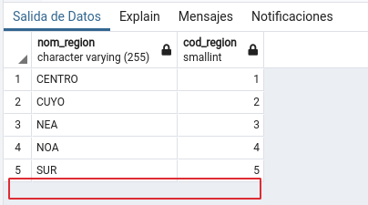
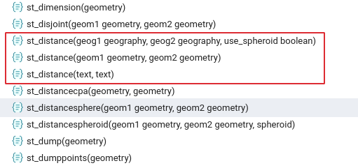

# Clase 2

## Temas de esta clase:
-   Extensión PostGIS.
-   Tablas de PostGIS: sistemas de referencia y columnas geométricas.
-   Tipos de geometrías.
-   Normativas de Open Geospatial Consortium (OGC).
-   Migración de datos espaciales desde Qgis.
-   SQL: comandos de actualización. Insertar, modificar y eliminar datos de una tabla.
-   SQL espacial: consulta de datos espaciales: superficie, longitud, SRID, tipo de geometría, cantidad de vértices y distancias.

## Referencias:
A lo largo del documento encontraremos íconos y recuadros que requieren de
una especial atención de los lectores:

> **ACTIVIDADES:** son consignas de actividades para realizar la práctica con
Qgis y pgAdmin acompañando la lectura. En la presente clase hay 5
actividades para resolver.

> **¡IMPORTANTE!:** Indica una actividad que no debe omitirse para poder
desarrollar correctamente la práctica de la clase.

## 1 Extensión PostGIS
PostGIS es un módulo que se añade al motor de bases de datos Postgres para
crear bases de datos espaciales que pueden ser utilizadas para trabajar con SIG. Este módulo fue creado por la empresa Refraction Research de Canadá, y fue puesto a disposición de la comunidad bajo la licencia pública general de GNU.

En el mundo de las bases de datos existen varios productos similares a
PostGIS, como la extensión Spatial de Oracle, o la extensión geográfica de MySQL, pero PostGIS demostró una amplia superioridad en el manejo de datos espaciales.
Esto se comprueba al ver que la mayoría de los nuevos productos de SIG incluyen la conexión a PostGIS (ArcGIS).

Además del soporte de datos geométricos (también datos
geográficos), PostGIS también añade numerosas funciones relacionadas con el
manejo de los datos espaciales, como el cálculo de distancia, superficie, perímetro,
reproyección, relaciones topológicas y procedimientos más avanzados de análisis
espacial.

Se pueden explorar estas funciones dentro de la base de datos espaciales que
hemos creado en la clase anterior “curso”. Dentro del esquema “public” abrimos el ícono denominado Funciones, y vemos que se despliegan casi 700 objetos.

Cada uno de ellos es una función relacionada con el manejo de datos espaciales. Más adelante veremos como aprovechar este tipo de recursos.

## 2 Tablas de PostGIS: sistemas de referencia y columnas geométricas

En la clase pasada vimos como crear la base de datos *“curso”* y como agregar la extensión *PostGIS* a esa base. Al momento de agregar *PostGIS* a nuestra base se creó en ella una tabla llamada *“spatial_ref_sys”* dentro del esquema *"public"*. 

La tabla **spatial_ref_sys** es un repositorio de los sistemas de referencia más
utilizados en los Sistemas de Información Geográfica. 

> En la clase 2 del curso de [Introducción a los SIG](#) vemos que en el mundo existen diversas formas de proyectar la superficie terrestre sobre un plano, y numerosos modelos matemáticos que representan la forma de la tierra, y que combinados con los sistemas geodésicos de cada región del planeta, dan como resultado infinidad de sistemas de referencia.

Recordemos también que existen instituciones que se erigieron como autoridades en la recopilación y codificación de estos sistemas de referencia, y que entre ellos una de las codificaciones más habituales es la impuesta por la EPSG, la Autoridad del Petróleo de Europa.

En esta tabla encontraremos un primer campo *"srid"* de tipo auto numérico en donde cada valor es único, y por lo tanto sirve para identificar unívocamente a cada registro.
Luego, aparece *"auth_name"* almacena el nombre de la autoridad a la que corresponde la codificación del SRID. En los SRID que usaremos en este curso, la autoridad es siempre la EPSG.
A continuación el campo *“auth_srid”* que como ya vemos se corresponde con el número identificador único de los sistemas de referencia. 

Finalmente se presentan dos campos en donde se describen los parámetros
que definen a cada uno de los sistemas de referencia, pero escritos según dos normas
diferentes. Una de ellas corresponde a la librería de sistemas de proyecciones **PROJ4**, la más utilizada en los SIG.

Es altamente recomendable utilizar los sistemas de referencias y sus
codificaciones más difundidos en el mundo de los SIG. Pero puede darse el caso en que necesitemos agregar un sistema de referencia que no fue incluido por Postgres, o bien un sistema de referencia completamente nuevo generado para un proyecto en particular. En estos dos casos, solo tenemos que agregar un nuevo registro a la tabla
*“spatial_ref_sys”* con un SRID que no esté siendo utilizado.
Por ejemplo, el Gobierno de la Ciudad Autónoma de Buenos Aires utiliza un
sistema de referencia con las siguientes características:
Sistema de Coordenadas y Proyección: Gauss Krugger Buenos Aires
Datum: Campo Inchauspe; Esferoide: Internacional 1924; Proyección: Transversa Mercator; Falso Este: 100000; Falso Norte: 100000; Meridiano Central: -58.4627;
Latitud de Origen: -34.6297166; Unidad: Metros; Factor De Escala: 0.999998.

Por otra parte, cuando agregamos tablas con datos geometricos, PostGIS nos agrega una vista llamada *“geometry_columns”* y otra *"geography_columns"* para datos geográficos.

Una vista es una tabla virtual en Postgres. Representa el resultado de una consulta a una o más tablas. Las vistas se utilizan para simplificar consultas complejas. En la proxima clase nos detendremos en las vistas con mas detalle, por ahora asumamos que una vista es como una tabla y que podemos consultar información de la misma manera.

La vista *"geometry_columns"* es empleada como un registro de
todas las columnas de tipo geometría que existen en la base de datos. Esto es muy útil para que los clientes de la base de datos espaciales (como Qgis, un servidor de mapas o una aplicación de mapas navegables) accedan rápidamente a los datos geográficos sin explorar toda la base; y además conozcan las características de esos sin tener que analizarlos.

La vista está compuesta por una primera columna que contiene un identificador
único automático de tipo numérico para cada registro. Luego presenta la columna
*“f_table_schema”* en donde se registra el nombre del esquema de la base de datos en donde al que pertenece la tabla.

Luego se registra el nombre de la tabla en *“f_table_name”*, y el nombre del
campo que contiene la geometría: *“f_geometry_column”*.
Hasta aquí vemos que con esos datos, por ejemplo un SIG de escritorio nos
podría traer sólo esas tablas para poder visualizarlas como capas, en lugar de traernos todas. A continuación vemos una imagen de Qgis.

A continuación veremos el resto de los campos que registran algunas
características muy importantes de cada campo geométrico.

El campo *“srid”* almacena el número correspondiente con el sistema de
referencia en que se encuentran proyectados los datos. El campo *“coord_dimension”* es en
donde se figura si la geometría corresponde a una representación en 2 o 3
dimensiones. Finalmente, el campo *“type”* indica el tipo de geometría que
hay en ese campo. De este último hablaremos más adelante en esta misma clase.

Cabe aclarar que una misma tabla puede poseer más de un campo con
geometrías. Por ejemplo, puede ser que por economía de los recursos de
procesamiento, decidamos almacenar la capa de usos del suelo de la Provincia de
Santa Fe con el SRID 4326 (en geográficas) y también en 22185 (en faja 5). Para
tener estos dos datos, no hace falta crear dos tablas diferentes, sino una misma tabla
con dos campos geométrico. Veremos más adelante que se le puede agregar un
disparador para que la actualización de un dato en cualquiera de los dos campos
impacte en el otro.
En ese caso el registro en la tabla geometry_columns quedaría de esta manera:

## 3 Tipos de geometría

La clase anterior incluyó un ejercicio para visualizar en un lenguaje comprnsible
el contenido de los campos geométricos. Vimos que en realidad, l
El dato geométrico de la entidad representada equivale al conjunto de coordenadas
que componen la figura geométrica. Los tipos de datos geométricos están
relacionados con esta descripción de las coordenadas.

El tipo POINT supone un solo punto, representado por una sola coordenada:

Esto podría utilizarse para representar a una ciudad a una escala nacional, por
ejemplo.

El tipo LINE implica dos coordenadas que representan a una recta, por ejemplo un
tramo de ruta recta entre dos ciudades:

Luego, el tipo LINESTRING también es una línea, pero que puede tener más de dos
coordenadas. Es decir, que además del punto de inicio y del final de la línea,
necesitamos más datos para poder representarla.

Esta distinción entre líneas y cadena de líneas (linestring) se debe a que existen
funciones que se pueden aplicar a una, pero no a la otra, por las diferentes
propiedades que tiene cada una en cuanto a figuras geométricas. Por ejemplo,
calcular el punto medio de una recta es sencillo, pero pretender hacer lo mismo con una LINESTRING nos puede dar como resultado un punto fuera de la figura.

El tipo POLYGON requiere la presencia de al menos tres coordenadas, que
generan un triángulo, que es el más sencillo de los polígonos. Un polígono implica una porción del espacio que queda comprendida dentro de la figura, y esto es muy importante para tener en cuenta a la hora de decidir representar las entidades del terreno.

Por ejemplo, difícilmente se pueda representar una serie de ciudad a escala
nacional por medio de polígonos, pero si empleamos una escala con mayor detalle
quizá debamos decidir qué tipo de geometría emplearemos. En este caso, los
objetivos del proyecto nos pueden ayudar: si necesitamos conocer la superficie del aglomerado, o calcular la cantidad de metros de ruta que atraviesan la ciudad, necesitaremos un polígono que nos brinde sus propiedades para realizar estos cálculos.

Finalmente,veremos las geometrías compuestas: MULTIPOINT, MULTILINESTRING, MULTIPOLYGON.

Muchas veces una entidad del terreno se puede representar con un conjunto
de figuras geométricas del mismo tipo, pero como entidad de nuestras bases
deseamos que se constituyan en un solo registro dentro de la tabla correspondiente.
Por ejemplo, la provincia de Tierra del Fuego, Antártida e Islas del Atlántico Sur en realidad es un solo registro en la tabla “provincias”, pero dicho registro está representado por varios polígonos (Isla Grande de Tierra del Fuego, isla de los Estados, Isla Soledad, Isla Gran Malvina, la Antártida, las Orcadas, etc.). En realidad se trata de un multipolígono, y se almacena como tal en la tabla.

Otro caso puede ser la Ruta Nacional 3, que comprende el tramo continental y
el tramo de Tierra del Fuego. Si el proyecto necesita que cada ruta sea un registro solo (por ejemplo, porque tiene un único presupuesto y autoridad a cargo), no tiene sentido almacenar la geometría con una lógica distinta al resto del proyecto.

La clave para decidir entre una figura múltiple o figuras sencillas por separado, es que se adapten a la lógica del resto de la información que tenemos en la base. Si cada tramo de la ruta implica datos diferentes, entonces lo correcto es crear más de un registro. Si no es así, al dividir los registros solo lograremos dificultar la relación entre el aspecto espacial y el alfanumérico de los mismos datos.

> **ACTIVIDAD 1:** Restaurar los archivos de resguardo (.backup) presentes en el material de práctica de esta clase.

## 4 Migración de datos espaciales: desde Qgis.

Existen diferentes alternativas para realizar la migración a Postgres de datos
espaciales almacenados en formatos shapefile (u otro previamente convertido a
shapefile). Por un lado Qgis y muchos otros SIG de escritorio disponen de
herramientas muy sencillas y eficaces. 

### 4.1 Qgis

Para comenzar, primero vamos a abrir en Qgis el shapefile [caminos.shp](material/caminos.shp) presente en el material de la clase.

Para añadir una capa vectorial (shapefile) podemos hacerlo desde el botón de acceso rápido en el panel lateral izquierdo  o desde el menú en la barra superior *Capa > Añadir capa > Añadir capa vectorial*.
Se abrirá una ventana donde tenemos que seleccionar el archivo caminos.shp como fuente, luego hacemos clic en el botón *Añadir*

Ya deberíamos poder ver la capa de caminos en nuestra vista de *Qgis*, para exportarla a *Postgres* necesitamos acceder al panel de *Administración de Bases* entonces vamos a la barra superior y buscamos la opción *Bases de datos > Administración de bases de datos...*

Se nos abre una nueva ventana, donde en el panel lateral podemos ver todas nuestras conexiones a la base. Si expandimos el objeto Postgis podemos ver la conexión a la base curso creada en la [clase1](../clase1#5-visualización-de-información-geográfica-de-la-base-desde-qgis) 

Seleccionamos la opción *Importar capa/archivo* 

Allí nos aparecerá una ventana en donde ya se detecta como *entrada* la capa de caminos, en caso de tener mas una capa simplemente seleccionamos la capa adecuada desde el menu desplegable.

A continuación seleccionamos a que esquema queremos enviar la capa y como se llamará la tabla, en caso de querer que la tabla se llame de otra forma. Dejamos esquema *public* y tabla *caminos*

Por último tenemos una serie de opciones donde vamos a destacar 2: clave primaria que corresponde al identificador único y columna geométrica que es el nombre de la columna donde se almacenará la geometría (sugerimos usar geom o the_geom)

Hacemos clic en *Aceptar* y se envían los datos.
Una vez finalizada la migración, podemos volver al pgAdmin y comprobar la
existencia de la nueva tabla.

También podemos ver que en la vista geometry_column ha sido añadido un
nuevo registro correspondiente al campo geométrico que terminamos de crear.

## 5 SQL: Comandos de selección. Comando WHERE

En la clase anterior vimos lo necesario para realizar una consulta de selección.
Recordemos que la estructura de esta consulta es:
>   **SELECT campos FROM tablas**

En este caso, agregaremos un nuevo comando que permite realizar filtros en
las consultas de selección. Dichos filtros están basados en los propios datos
almacenados en la tabla.

Por ejemplo, si queremos obtener las provincias de la región Centro,
colocaremos:
>   *SELECT nom_prov FROM censo2010 **WHERE** region = 'CENTRO'*

Lo valores de tipo texto o string siempre se escriben entre comillas simples:
>   'CENTRO'

Obsérvese que generalmente la cláusula *WHERE* se compone de un campo,
un operador lógico y un valor.

El tipo de operador lógico empleado depende del tipo de dato de los campos
filtrados. Por ejemplo, podemos seleccionar de la tabla de departamentos los campos que contienen el código y el nombre de los departamentos, pero solo para aquellos que en el campo “poblacion” tienen un valor mayor a 500.000 habitantes

>   SELECT cod_depto, nom_depto FROM datos_depto **WHERE** poblacion > 500000;

En este caso, el operador lógico pertenece a una operación matemática que
solo se puede utilizar cuando se cuenta con un campo numérico.

Las condiciones de filtrado se pueden concatenar mediante los nexos **“OR”** y
**“AND”**. 

Por ejemplo, si queremos obtener los dapartamentos con menos de 10.000
habitantes y que pertenezcan a la región NOA, la consulta será:

>   **SELECT** cod_depto, nom_depto **FROM** datos_depto 
**WHERE** poblacion < 10000 **AND** region = 'NOA'

El nexo **“AND”** indica que los elementos necesitan cumplir las dos condiciones para ser seleccionados (ser del NOA y tener menos de 10.000 habitantes)

Si en cambio queremos seleccionar aquellos elementos que cumplan una u
otra condición (cualquiera de las dos), entonces usamos el nexo **“OR”**. 
Por ejemplo, si deseamos obtener las ciudades más importantes del país, pediremos aquellas que
tengan más de medio millón de habitantes. Pero puede pasar que haya otras ciudades importantes, como las capitales de provincia, que sin ser tan grande, igualmente son importantes. 
Entonces la consulta será:

>   **SELECT** nom_loc FROM localidades
**WHERE** poblacion > 500000 **OR** capital = 'SI'

## 6 SQL: comandos de actualización. Insertar, eliminar y modificar datos de una tabla.

### 6.1 Insert

La acción de agregar un nuevo registro a una tabla se puede lograr de diferentes
maneras.
La más sencilla es ingresando a la visualización de la tabla con el botón *Ver los
datos*  del objeto seleccionado
y luego escribiendo en el último registro. Luego es necesario hacer clic en el botón "Guardar cambios".

Esto sólo es posible cuando la tabla tiene definida una clave primaria, ya que de esta manera
pgAdmin puede identificar unívocamente a cada uno de sus registros.

Otra forma es editando la tabla desde Qgis o cualquier SIG. En este caso,
solo se pueden editar tablas que contienen datos geométricos. La forma de editar la
tabla es similar a la edición de cualquier otra capa: se pone en estado de edición la tabla y luego se agrega un nuevo elemento a la capa.

Finalmente, se puede agregar nuevo registros también utilizando el lenguaje **SQL**. El comando utilizado es **INSERT INTO**.

Por ejemplo, para agregar un nuevo registro a la tabla de regiones, la consulta es la siguiente:

> **INSERT INTO** regiones **VALUES** ('METROPOLITANA',6);

Primero se escribe *“INSERT INTO”*, luego el nombre de la tabla, después
*“VALUES”* y finalmente entre paréntesis se colocan los valores correspondientes a los campos en el mismo orden en que se estructura la tabla. En este caso agregamos el identificador “6” y el nombre de la región “METROPOLITANA”

Como resultado esta vez no obtenemos una tabla, sino un aviso que nos
informa que la consulta se ha realizado con éxito, afecta a 1 fila. Podemos ver el resultado abriendo la tabla.

Si solo queremos agregar valores a determinado campo de la tabla y no a
todos, entonces agregamos la el nombre de dichos campos antes a continuación del
nombre de la tabla:

> **INSERT INTO** regiones (nom_region) **VALUES** ('METROPOLITANA')

En este caso el campo “cod_region” quedará vacío. Puede ocurrir que los
campos tengan restricciones que no admitan valores nulos. Más adelante veremos de
qué se tratan las restricciones.

> **ACTIVIDAD 3:** Insertar un nuevo registro en la tabla “censo2010” con los siguientes datos:
    Nom_prov = “PROVINCIA DEL PLATA”
    Nom_region = “METROPOLITANA”
    Pob2010 = 15.000.000
    Cod_prov = “05”

### 6.2 Delete

El comando utilizado para eliminar registros es **“DELETE”**. Generalmente se
utiliza acompañado de **“WHERE”**, ya que es muy raro que necesitemos borrar todos
los datos de una tabla, pero manteniendo la estructura.

Por ejemplo, si queremos borrar el registro que recién creamos, escribimos:

>   **DELETE FROM** regiones **WHERE** nom_region = 'METROPOLITANA'

En caso de que realmente necesitemos borrar todo el contenido de una tabla,
pero manteniendo su estructura, entonces sí utilizamos el comando **“TRUNCATE”**.

>> **TRUNCATE** **TABLE** regiones;  ---(Atención. Esta orden borra el contenido. No correrla.)

### 6.3 Modificar

El comando SQL utilizado para modificar los valores en las celdas de una tabla
es **“UPDATE”**. Se diferencia de **“INSERT”** y de **“DELETE”** en que **“UPDATE”** no agrega
ni quita registros, sino que solo altera el contenido de las celdas existentes.

Se pueden actualizar todas las celdas de una columna. Por ejemplo, podemos
decirle a Postgres que todos los registros de la tabla caminos figuren como
“PAVIMENTADO” en el campo “clase”

> **UPDATE** caminos **SET** clase = 'PAVIMENTADO'

Como vemos, la estructura de esta consulta es **“UPDATE”**, el nombre de la
tabla, luego el comando **“SET”**, el nombre del campo y el valor que irá en ese campo.

La consulta no devuelve una tabla, ya que no es de selección. Pero sí nos
devuelve el mensaje que dice que han sido afectadas 8789 filas. Para ver el resultado
podemos abrir la tabla con el botón de "Ver datos" correspondiente:
o bien, realizar la consulta de selección

> **SELECT** * **FROM** caminos

También puede ocurrir que sólo deseemos actualizar una parte de los registros
en función de alguna condición que cumplen. Por ejemplo, podemos actualizar de
nuevo el campo “clase”, pero esta vez le pedimos a Postgres que le coloque el valor
“DE TIERRA” a los caminos de jurisdicción vecinal. Para agregar la condición
utilizaremos el comando **“WHERE”** visto al principio de la clase.

> **UPDATE** caminos **SET** clase = ‘DE TIERRA’ **WHERE** jurisdicci = ‘VECINAL’

En este caso, podemos ver que los únicos registros que cambiaron sus valores
en el campo “clase” son aquellos que cumplen con la condición solicitada.

Y el resultado…

También podemos actualizar los datos de un campo aprovechando los valores
existentes en la misma tabla. En este caso, luego de SET colocamos la expresión que
genera el nuevo valor.

Por ejemplo, podemos agregar la columna “densidad” a la tabla “censo2010” y
calcular dentro de ella el resultado de la división entre los campos “poblacion” y
“superficie”

Para agregar el nuevo campo podemos correr la siguiente consulta:

>   **ALTER TABLE** censo2010 **ADD COLUMN** densidad double precision;

O bien pararnos en el objeto Columnas dentro de la tabla “censo2010”, y luego
cliqueamos con el botón derecho y seleccionamos *Crear > Columna*.

Esto nos abrirá una ventana en donde colocaremos el nombre (pestaña general) y el tipo de dato,
que en este caso es “double presicion”, que admite decimales.

Una vez agregada la columna, podemos correr la consulta que coloca el valor
de densidad calculado.

>   **UPDATE** censo2010 **SET** densidad = pob2010 / superficie;

Aquí podríamos agregar también a continuación la cláusula WHERE, pero en
este caso queremos que el cambio se realice en todas las filas.

>   **ACTIVIDAD 4:** Agregar un campo “diferencia” a la tabla “censo2010”. Calcular la diferencia
de población entre 2010 y 2001.

## 7 SQL espacial: consulta de datos espaciales: distancia, superficie, longitud, SRID, tipo de geometría y cantidad de vértices.

Ahora veremos una serie de comandos que nos devuelven información
extraída o procesada a partir de los datos geométricos.

### 7.1 Geometría como texto

En la primera clase vimos una consulta muy sencilla que nos devuelve el dato
geométrico traducido a un lenguaje fácil de interpretar:

>   **SELECT** nombre, **ST_ASTEXT**(the_geom) **FROM** ciudades;

Esto nos devuelve el dato geométrico de manera literal, y se puede comprobar
lo expuesto al principio de la clase referido a los tipos de geometrías.

### 7.2 SRID

También dentro del campo geométrico se almacena el SRID, el número
identificador del sistema de referencia en el que está proyectada la información.

>   **SELECT** nombre, **ST_SRID**(the_geom) from ciudades;

Esta consulta nos sirve para corroborar un sistema de referencias antes de
realizar una reproyección, o algún cálculo que necesite un determinado sistema de
referencias.

### 7.3 Tipo de geometría

Para averiguar el tipo de geometría que se ha utilizado para almacenar un dato,
escribimos

>   **SELECT** **GEOMETRYTYPE**(the_geom) FROM ciudades;

Es importante remarcar que siempre es necesario colocar el campo geométrico
en las consultas de este tipo. No solo porque la estructura de la función lo requiere,
sino también porque podría existir otro campo geométrico dentro de la misma tabla.

### 7.4 Cantidad de vértices

En la primera parte de la clase vimos que para poder utilizar algunos tipos de
geometría, era importante la cantidad de vértices de la figura. Para averiguar este dato
escribimos:

> **SELECT** **ST_NPOINTS**(geom) FROM caminos;

Esta función como las anteriores pueden utilizarse tanto como parte del pedido
de campos en la consulta de selección, como también en las condiciones de
“WHERE”. Por ejemplo si queremos conocer los tramos de ruta que tienen solo 2
vértices, y por lo tanto podrían ser convertidos de “LINESTRING” a “LINE” para
aplicarle cálculos específicos, podemos escribir:

>   **SELECT** * **FROM** caminos **WHERE** **ST_NPOINTS**(geom) = 2;

### 7.5 Longitud, area y perímetro.

En este caso veremos como calcular algunos datos básicos de nuestras
geometrías. Cabe aclarar, previamente, que este tipo de cálculo solo es posible
cuando se cuentan con coordenadas planas, es decir, cuando la unidad en la que
están expresadas las coordenadas son metros (para nuestro país). Esto es así debido
a que estos cálculos son propios de la geometría euclidiana, en donde es espacio es
plano; y en el caso de las coordenadas angulares (en grados) el principio es diferente.

Hay cálculos que se pueden realizar solo en ciertos tipos de geometrías, y en
otro no, como la superficie, que no puede ser aplicada ni en líneas ni en puntos.
Empecemos por la más simple. La longitud de una línea.

>   **SELECT** nombre, **ST_LENGTH**(geom) **FROM** caminos;

Nos devuelve el nombre de la ruta y la longitud de de cada tramo. Las unidades
en que están expresadas dichas longitudes las mismas que las coordenadas, es decir:
metros. Si deseamos ver estas longitudes, por ejemplo, en kilómetros, solo debemos
aplicar la operación matemática correspondiente a la consulta.

>   **SELECT** nombre, **ST_LENGTH**(geom)/1000 FROM caminos;

Y podemos agregar un alias al campo de resultado que aparece sin nombre
>   **SELECT** nombre, **ST_LENGTH**(the_geom)/1000 **AS** long_km **FROM** caminos;

El cálculo del area o superficie es similar, pero se aplica solamente a los
polígonos:

>   **SELECT** nom_depto, **ST_AREA**(the_geom) **FROM** departamentos;

En este caso, convertido a kilómetros y con el nombre agregado.

### 7.5 Distancias

Para finalizar veremos como se realiza el cálculo de distancias. Se realiza a
partir de la función **ST_DISTANCE**, la cual podemos conocer a partir de navegar por el
árbol de objetos de pgAdmin, dentro del esquema “public” dentro de *Funciones*.

Allí vemos que la función tiene la estructura:
>   **ST_DISTANCE**(geometry, geometry)

Esto significa que se necesitan dos geometrías para poder calcular una
distancia. Por ejemplo, si tenemos una tabla de vuelos que realiza un avión sanitario,
podemos tener en una columna “geom_inicial” donde se almacena el punto donde
inicia cada viaje, y luego otra columna “geom_final” que contiente el punto del lugar
donde termina el vuelo. En este caso, para calcular la distancia de cada vuelo
haríamos la siguiente consulta:

>   **SELECT** **ST_DISTANCE**(geom_inicial, geom_final) **from** vuelos.

Pero en la realidad, generalmente se calcula la distancia existente entre cada
elemento de la tabla y otro punto conocido. En este caso el valor variable es el del
campo de la tabla, mientras que el valor permanente es ese punto fijo que deseamos
establecer.

Por ejemplo, si queremos conocer la distancia de cada localidad del país hacia
la ciudad de Mar del Plata, podemos empezar la consulta de esta manera:

>   **SELECT** nom_loc, **ST_DISTANCE**(the_geom, PUNTOFIJO) **FROM** localidades;

Luego continuamos reemplazando “PUNTOFIJO” por la consulta que nos trae
el punto de la ciudad de Mar del Plata:

>   **SELECT** the_geom **FROM** localidades **WHERE** nom_loc = 'MAR DEL PLATA'

Esto nos devuelve un solo registro del campo “the_geom”. Este será el punto
fijo que utilizaremos en la consulta. La forma de incorporarlo en reemplazar
“PUNTOFIJO” por esta consulta encerrada entre paréntesis.

>   **SELECT** nom_loc, **ST_DISTANCE**(the_geom, (**SELECT** the_geom **FROM** localidades **WHERE** nom_loc = 'MAR DEL PLATA') ) **FROM** localidades;

Todo lo resaltado es lo que reemplaza a “PUNTOFIJO”. Nótese que
la consulta respeta la estructura de la función ST_DISTANCE, ya que proporciona dos
geometrías: la primera es un campo geométrico y la segunda es una geometría
producida por otra consulta.

Por supuesto, la distancia obtenida está en metros, por lo cual es necesario
pasarla a kilómetros, para hacer una lectura más adecuada.

>   **SELECT** nom_loc, **ST_DISTANCE**(the_geom,
(**SELECT** the_geom **FROM** localidades **WHERE** nom_loc = 'MAR DEL PLATA')) /1000 as distancia **FROM** localidades;

>   **ACTIVIDAD 5:** Calcular la distancia desde todas las localidades a la ciudad de Salta.

## 8 Bibliografía

-   OLAYA, Víctor. (2011). Sistemas de Información Geográfica. Versión 1.0, Rev. 24 de
marzo de 2011. Proyecto “Libro Libre SIG”.
http://forge.osor.eu/docman/view.php/13/577/Libro_SIG.zip

-   THE POSTGIS TEAM. Manual de PostGIS 1.5.3.
http://www.postgis.org/download/postgis-1.5.3.pdf

-   OBE, Regina y HSU Leo. (2011). PostGIS in Action. Editorial Manning. Stamford.