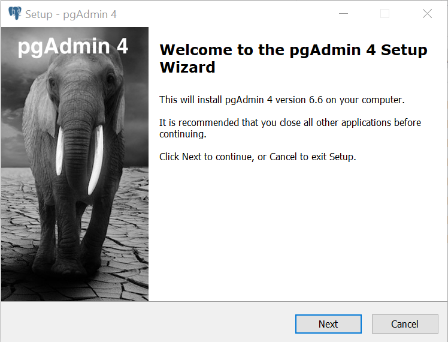
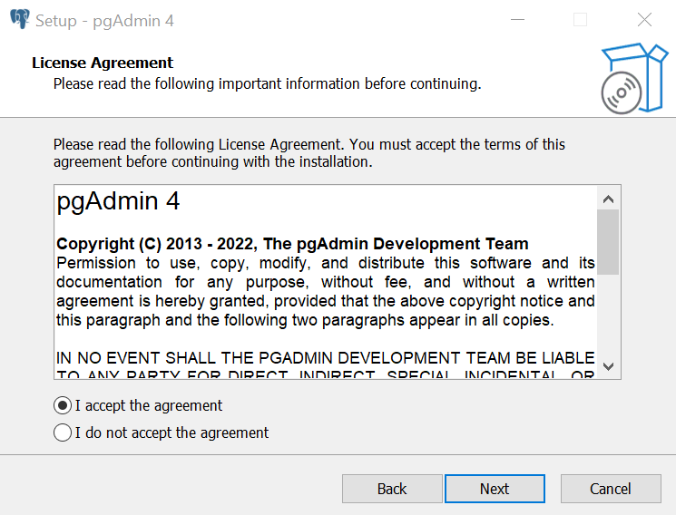
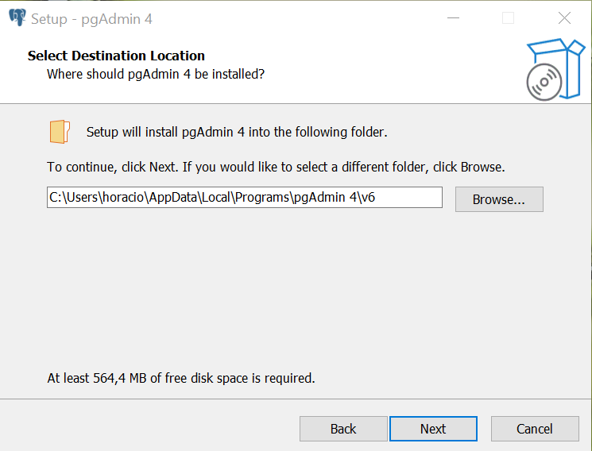
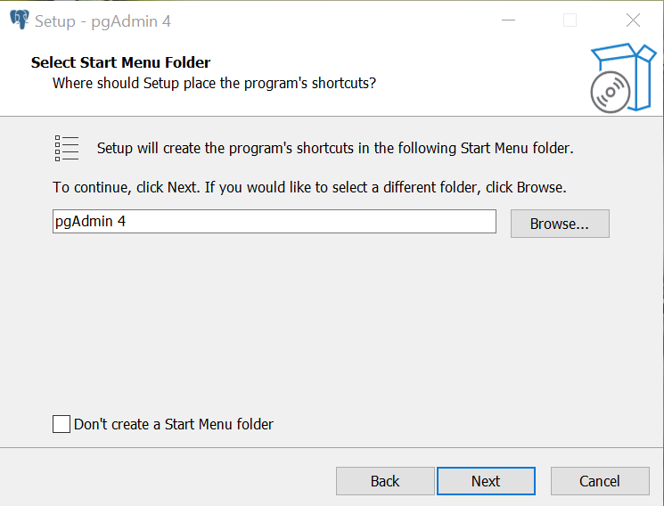
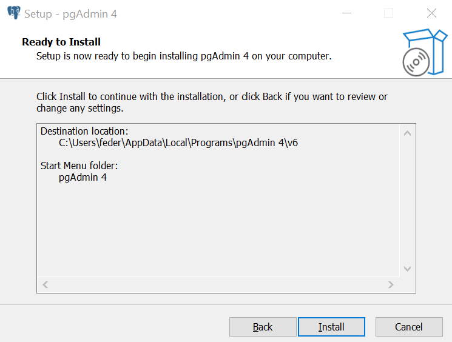
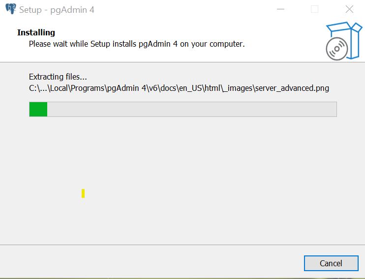
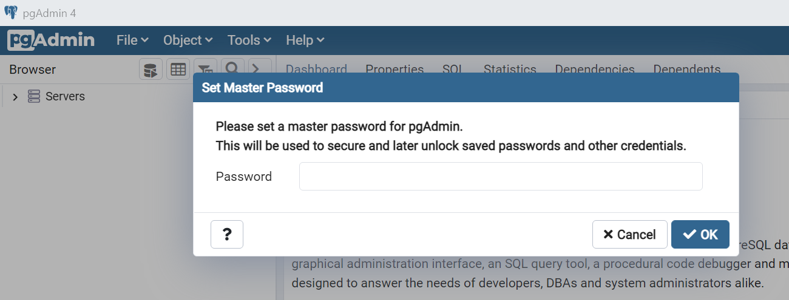

# Instructivo de instalación de pgAdmin4

#### *Aclaración: en las versiones mas modernas del instalador de PostgreSQL para windows ya se incluye el pgAdmin4 en la seccion de componentes junto con el Stack Builder*

## 1 - Descargar e instalar pgAdmin4

El instalador se debe descargar desde: [https://www.pgadmin.org/download/](https://www.pgadmin.org/download/)

Al ejecutar el instalador aparecerá la ventana de bienvenida. Next.

Habrá que aceptar los términos de la licencia. Next.

Seleccionamos el directorio destino de instalación

Opcionalmente se puede seleccionar carpeta donde estará un acceso directo a Pgadmin4. Next.

Y finalmente los aparece la ventana que avisa que está todo listo para realizar
la instalación. 
Presionamos Install.

Aparece la barra de estado mostrando el avance de la instalación. 
Cuando
termina presionamos Next.

Finalmente, al terminar apretamos Finish.

## 2 - Establecer contraseña maestra

Cuando abrimos PgAdmin4 por primera vez nos va a pedir que creemos una contraseña maestra, es muy importante que recordemos esta contraseña porque será pedida cada vez que abramos el programa.

