# Instructivo de instalación de PostgreSQL + PostGIS

## 1 - Descargar PostgreSQL

Al momento de escribir estas líneas, la versión mas reciente es PostgreSQL 14 y vamos a asumir PostGIS 3.1+ en adelante.

Descargar la versión acorde a su sistema (Windows, Linux, MacOS) desde el siguiente link [https://www.postgresql.org/download/](https://www.postgresql.org/download/)

## 2 - Ejecutar instalador

Para instalar el programa, en primer lugar hacemos doble clic sobre el
instalador descargado, y nos aparecerá la ventana de bienvenida, donde apretaremos
Siguiente.

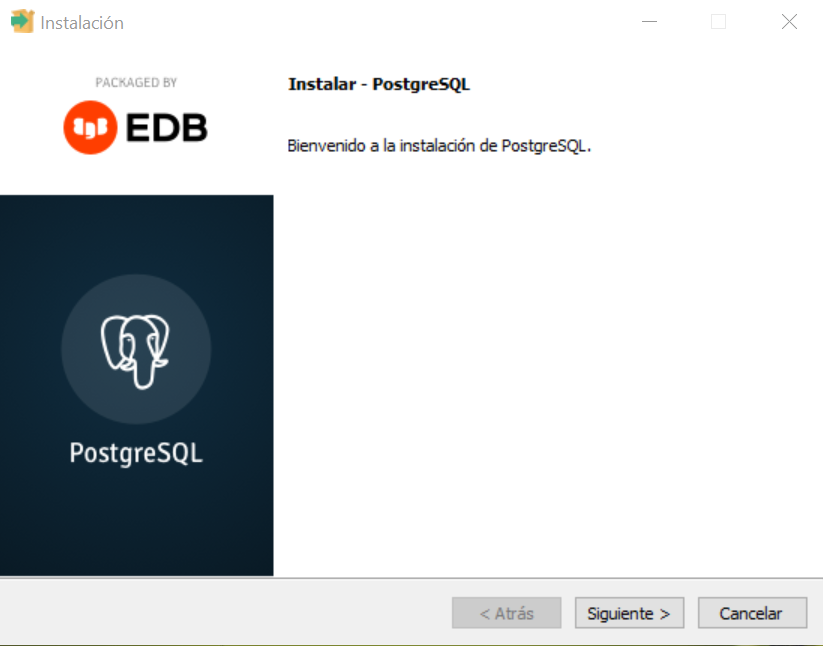

Nos muestra donde se instalará el programa. Siguiente.

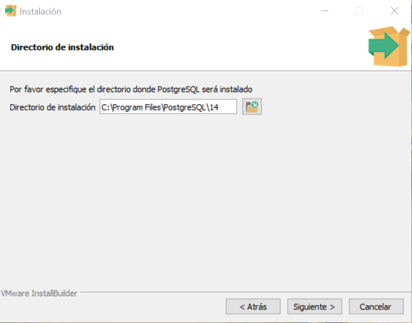

Nos muestra la ruta en donde se almacenarán los datos. Siguiente.

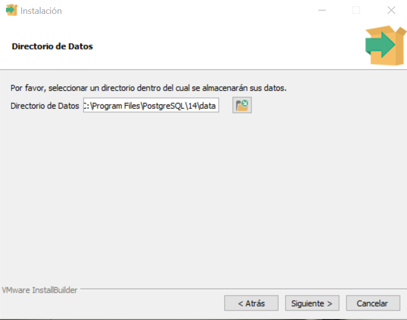

Nos muestra los diferentes componentes que podemos agregar a la instalación.

Sugerimos seleccionar todos los componentes pero especialmente *Stack Builder* que nos facilitará la instalación de *PostGIS* (explicada unas líneas mas abajo).

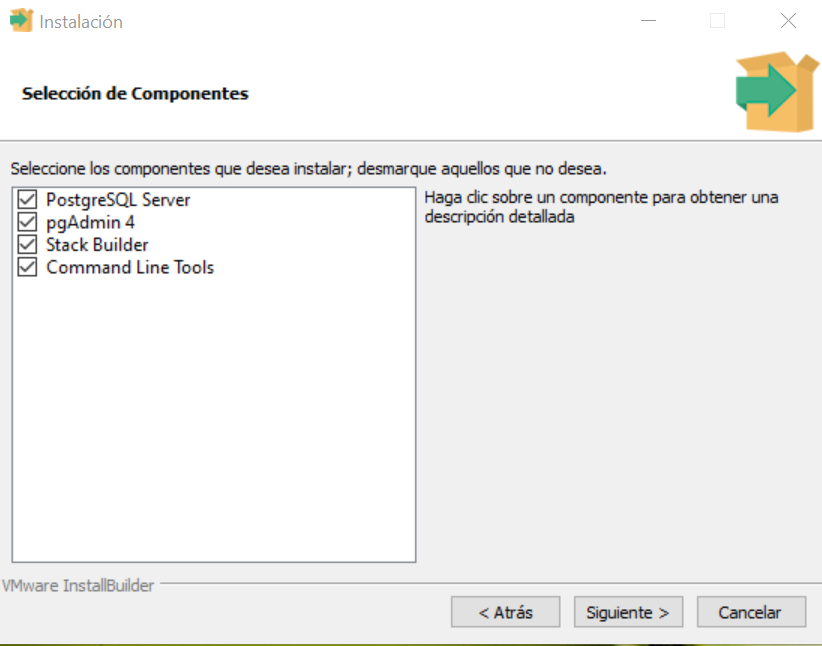

Nos pide la contraseña del Super-Usuario de Postgres que es llamado
“postgres” y la misma contraseña para la cuenta de servicio de Windows que también
se denomina “postgres”.

En un primer momento, sugerimos colocar la palabra “postgres” como
contraseña. Es muy importante recordar siempre esta contraseña.

Nos muestra el puerto que se utilizará para acceder al motor de Postgres.

Mantenemos 5432.

En la Configuración Regional optamos por “Spanish, Argentina”.

El instalador nos muestra un resumen de la configuración utilizada para la instalación.

Cliqueamos Siguiente.

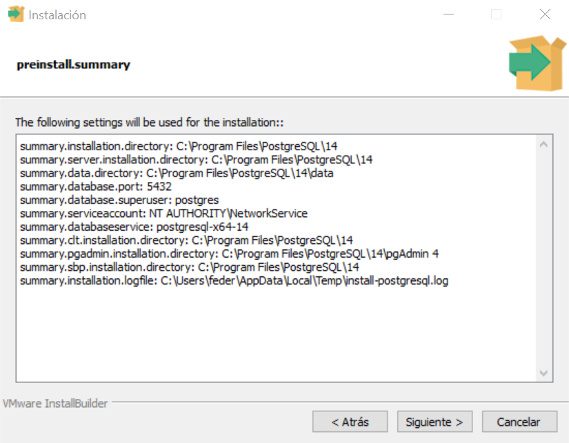

El instalador nos avisa que está todo listo para iniciar la instalación.

Cliqueamos Siguiente.

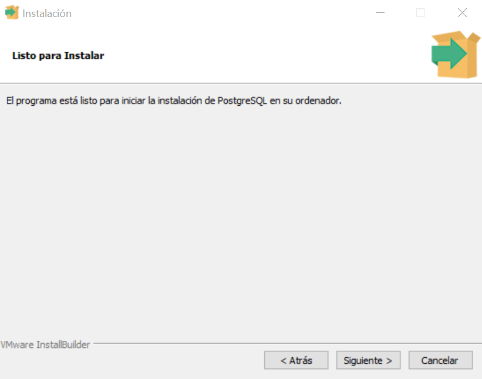

Aparecerá una barra de estado mostrando el avance de la instalación.

Esperamos hasta que se complete y nos de la posibilidad de seleccionar Siguiente.

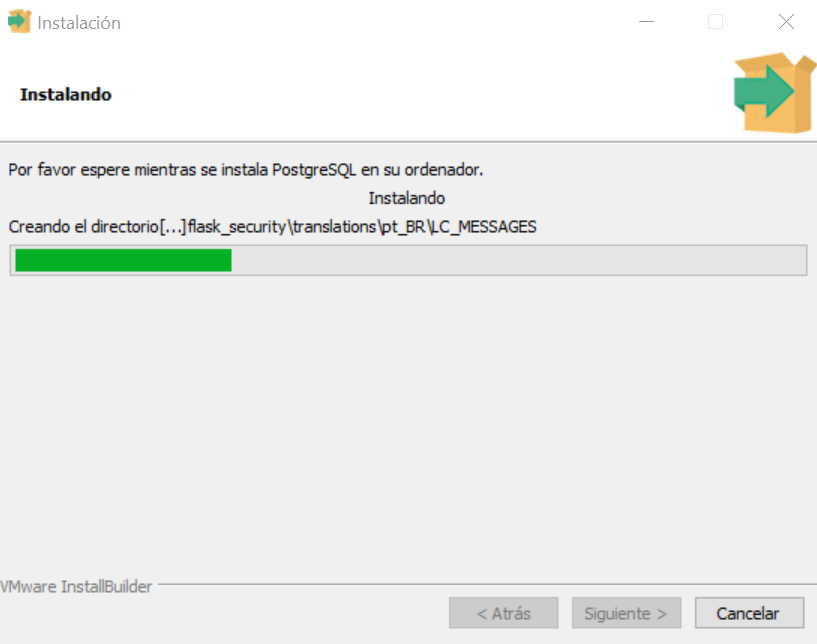

### Stack builder

Una vez finalizada la instalación de PostgreSQL tenemos la opción de
lanzar la aplicación Stack Builder que nos ayudará a descargar e instalar las
herramientas adicionales. 
Activamos el checkbox y seleccionamos Terminar.

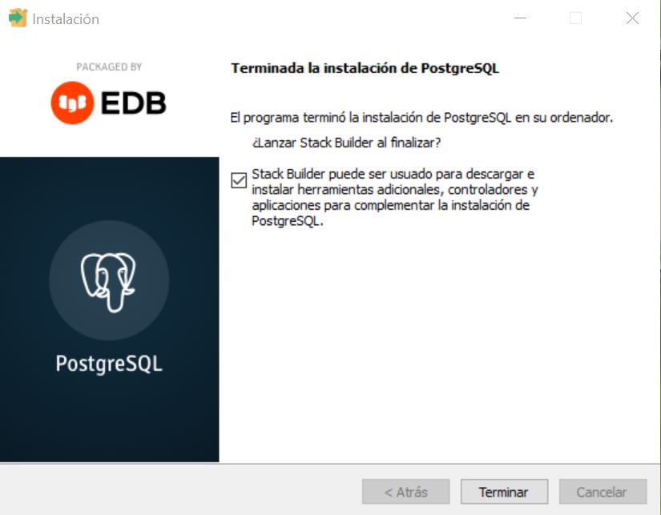

## 3 - Instalar PostGIS utilizando el Stack builder

Una vez finalizada la instalación del motor de bases de datos, el mismo instalador
nos da la opción de lanzar la aplicación Stack Builder. Esta aplicación nos permite
seleccionar las herramientas adicionales de Postgres para descargarlas e instalarlas.

Se puede lanzar el Stack Builder a continuación de la instalación de Postgres, o
bien ejecutar Stack Builder desde Inicio, Todos los programas, PostgreSQL 14,
Aplication Stack Builder,
Stack Builder debe conectarse a Internet para poder descargar los instaladores.
En caso de no contar con conexión o permiso para acceder a Internet, será necesario
descargar los instaladores desde otra máquina y luego ejecutarlos

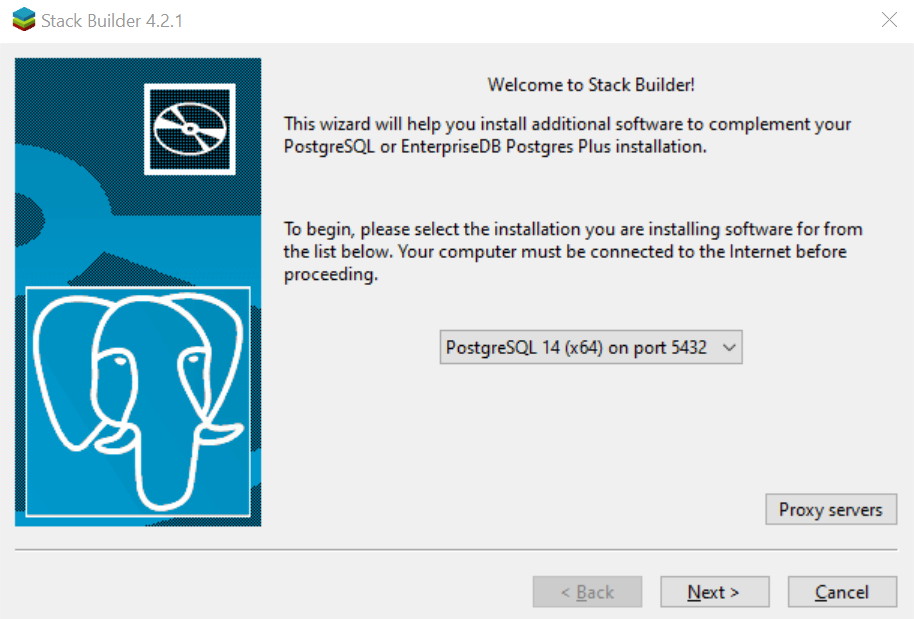

Luego, seleccionamos en Spatial Extensions la opción con la versión mas reciente de PostGIS 3.1+ for
PostgreSQL 14 y finalmente apretamos Next.

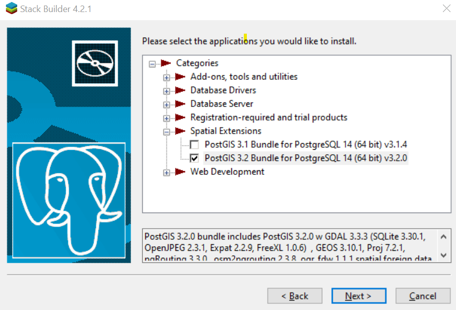

La descarga empezará, y al finalizar nos aparecerá una ventana que nos
informa que podemos empezar la instalación. 

El checkbox de *Create spatial database* es opcional, si se selecciona esa opción se creará una base de datos con la extension de Postgis activada. Generalmente esta opción se deja deseleccionada y se agrega Postgis manualmente a la base de datos de nuestra preferencia utilizando la sentencia *CREATE EXTENSION postgis;*

Presionamos Next.

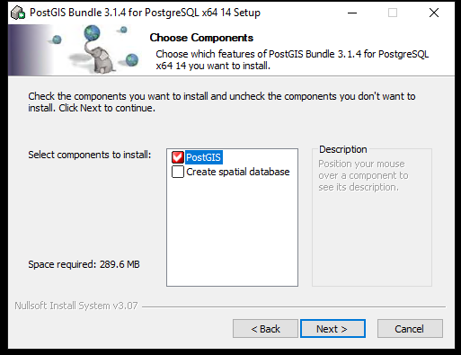

En Windows es probable que se muestren algunas ventanas de confirmación para finalizar la instalación de PostGIS:

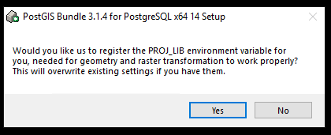

Esto se debe a que para realizar operaciones que requieren transformaciones de ráster PostGIS utiliza los archivos epsj de GDAL.

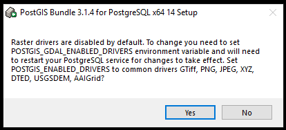

Habilitar controladores para rasters. Seleccionando *Yes* se habilitarán los controladores mas comunes.

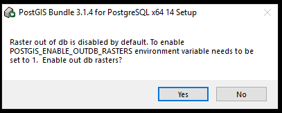

Para permitir el acceso a bandas ráster fuera de la base de datos

